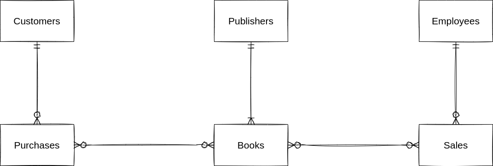
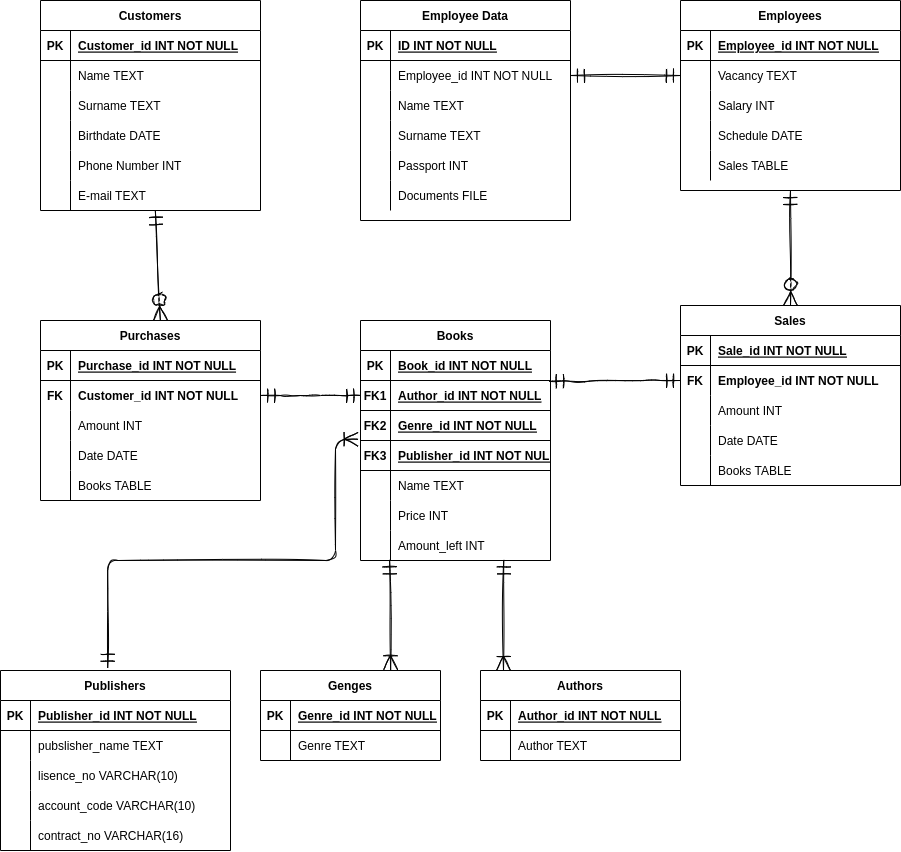

# Проект по курсу Базы Данных 2022 ФПМИ
## Тема: База данных для книжного магазина

Идея создания базы данных заключается в оптимизации и повышении удобства обслуживания клиентов, упрощения работы книжного магазина, представленного в единичном экземпляре. Расширяемость не поддерживается в виду отсутствия разбиения на магазины (departments). 
Всю базу данных можно разделить на несколько сущностей:

1. Клиенты
2. Покупки
3. Книги
4. Жанры
5. Авторы
6. Продажи
7. Работники
8. Издатели

Также есть таблицы, хранящие в себе дополнительную информацию.

Почти между всеми сущностями отношение один ко многим, что обусловлено логикой и ничем кроме логики. Однако есть биективные отображения вида “employee - employee data”. Эта декомпозиция нужна была для поддержки 3НФ. 3НФ удобна для работы своей понятной логикой вследствие сильной декомпозиции, однако требует мощного владения языком запросов из-за того же. 
В поддержку данной БД входит обновление информации по сущностям (изменение зп, изменение книг в наличии и т.д.). Также хочется реализовать удобное добавление транзакций: покупка клиентом, продажа сотрудником и т.д.
Возможной проблемой может являться отсутствие возможности для масштабируемости: если клиент захочет открыть новый магазинчик или начать торговать не только книгами, но и журналами, то базу данных придётся переделывать.
Также у этой базы данных есть и ограничения, например ограничения по первичному ключу, он есть во всех сущностях, а также в некоторых отношениях есть ограничения по внешнему ключу

## Запуск  
Сервер с базой данных находится в Docker-контейнере, из которого выставлен порт 5050. Вся конфигурацию прописана в
Dockerfile-compose файле. Из директории с файлом:  
Запуск: ``docker-compose up ``  
Подключение к контейнеру: ``напишу позже``  
Завершение работы: `` docker-compose down ``

## Концептуальная модель
  

## Логическая модель
  

## Физическая модель
#### Customers
| Field name | Description | Data type | Restrictions |
|---|---|---|---| 
| customer_id | customer`s ID | SERIAL | NOT NULL UNIQUE PRIMARY KEY |
| user_nm |  customer`s name | VARCHAR(20) | NOT NULL |
| user_last_nm | customer`s lastname | VARCHAR(20) | NOT NULL |
| user_birth_dt | customer`s lastname | DATE | |
| mobile_phone_no | customer`s phone number | INTEGER | UNIQUE |
| email_no | customer`s email address |  VARCHAR(40) | UNIQUE |
| card_no | customer`s card number |  VARCHAR(40) | |

#### Purchases
| Field name | Description | Data type | Restrictions |
|---|---|---|---| 
| purchase_id | purchase`s ID | SERIAL | NOT NULL UNIQUE PRIMARY KEY |
| customer_id | customer's ID | SERIAL | NOT NULL |
| book_id | book's ID | SERIAL | NOT NULL |
| purchase_amount | amount of purchased books | INTEGER | NOT NULL |
| purchase_dt | date of purchase | DATE | |

#### Genres
| Field name | Description | Data type | Restrictions |
|---|---|---|---| 
| genre_id | genre`s ID | SERIAL | NOT NULL UNIQUE PRIMARY KEY |
| genre | genre`s name | VARCHAR(30) | |

#### Authors
| Field name | Description | Data type | Restrictions |
|---|---|---|---| 
| author_id | author`s ID | SERIAL | NOT NULL UNIQUE PRIMARY KEY |
| author | author`s name | VARCHAR(30) | |

#### Publishers
| Field name | Description | Data type | Restrictions |
|---|---|---|---| 
| publisher_id | publisher`s ID | SERIAL | NOT NULL UNIQUE PRIMARY KEY |
| publisher_name | publisher's name | VARCHAR(30) | |
| License_no | Lisense unique number | VARCHAR(10) | |
| Account_code | Account unique number | VARCHAR(10) | |
| Contract_no | Contract unique number | VARCHAR(16) | |

#### Books
| Field name | Description | Data type | Restrictions |
|---|---|---|---| 
| book_id | book`s ID | SERIAL | NOT NULL UNIQUE PRIMARY KEY |
| author_id | author`s ID | SERIAL | NOT NULL UNIQUE PRIMARY KEY |
| genre_id | genre`s ID | SERIAL | NOT NULL UNIQUE PRIMARY KEY |
| publisher_id | publusher`s ID | SERIAL | NOT NULL UNIQUE PRIMARY KEY |
| name | name of the book | VARCHAR(30) | |
| price | book's price | INTEGER | |
| amount_left | amount of books left | INTEGER | |

#### Employees
| Field name | Description | Data type | Restrictions |
|---|---|---|---| 
| employee_id | employee`s ID | SERIAL | NOT NULL UNIQUE PRIMARY KEY |
| salary | employee's salary | INTEGER | >= 0 |
| vacancy | vacancy's name | VARCHAR(30) | |
| shifts_worked_amt | employee's number of worked shifts | INTEGER | >= 0|
| works_now_flg | does employee is working at the moment | BOOLEAN | |

#### Employee_data
| Field name | Description | Data type | Restrictions |
|---|---|---|---| 
| id | ID | SERIAL | NOT NULL UNIQUE PRIMARY KEY |
| employee_id | employee`s ID | SERIAL | NOT NULL UNIQUE PRIMARY KEY |
| name |  employee`s name | VARCHAR(30) | NOT NULL |
| surname | employee`s lastname | VARCHAR(30) | NOT NULL |
| Passport_series | employee's passport series | VARCHAR(4) | LENGTH == 4 |
| Passport_no | employee's passport number | VARCHAR(6) | LENGTH == 6 |
| credit_card_no | employee's credit card number | TEXT | |
| contract_no | employee's contract number | TEXT | |

#### Sales
| Field name | Description | Data type | Restrictions |
|---|---|---|---| 
| sale_id | sale`s ID | SERIAL | NOT NULL UNIQUE PRIMARY KEY |
| employee_id | employee`s ID who sold the book | SERIAL | NOT NULL UNIQUE PRIMARY KEY |
| book_id | sold book`s ID | SERIAL | NOT NULL UNIQUE PRIMARY KEY |
| amount | amount of books sold | INTEGER | |
| date | sell date | DATE | |

## Выполнение технического задания по проекту  
### Структура файлов.
| Задание | Файл |
|---------|------|
| Инициализация таблиц | `init.sql` |
|Наполнить созданную базу данными, ~10 записей в каждой таблице. По крайней мере по 1 строке в каждой таблице должно быть добавлено с использованием `INSERT`.| `fill.sql`|
|  Написать не менее 10 `INSERT`, `SELECT`, `UPDATE`, `DELETE` запросов. Загуглить, что такое CRUD-запросы. Найти соответствие. | `10requestsCRUD.sql` |
 Написать не менее 6 осмысленных `SELECT`-запросов с использованием: `GROUP BY + HAVING`, `ORDER BY`, `PARTITION BY`, `ORDER BY`, `PARTITION BY + ORDER BY`, `<func>` - все 3 типа функций - агрегирующие, ранжирующие, смещения. К коду приложить ваши ожидания от работы запроса в виде комментария в CI. | `SpecificRequest.sql`| 
| Создать индексы для таблиц, аргументировав выбор поля, по которому будет создан индекс. | `indexes.sql` |
| Подготовить не менее 6 представлений: 2-3 получаются сокрытием полей с персональными данными клиентов из таблицы, а также сокрытием технических полей. Например, для поля `CARD_NO` можно использовать маскировку вида `4276********0000`. 3-4 получаются соединением нескольких таблиц с целью получения осмысленной сводной таблицы, например, хранящей некоторую статистику продаж/частот обращения клиента и т.д. Вместе с кодом приложить описание представления. | `views.sql` |
| Создать не менее 2 хранимых процедур | `procedures.sql` |
| Создать не менее 2 триггеров | |
| Используя любимый язык программирования и библиотеку, сгенерировать данные и с их помощью вставить данные в уже  оформленную БД. Теми же инструментами извлечь данные [из таблицы на выбор], возможно, предварительно агрегированные средствами СУБД, и провести анализ. | `script.py` |
